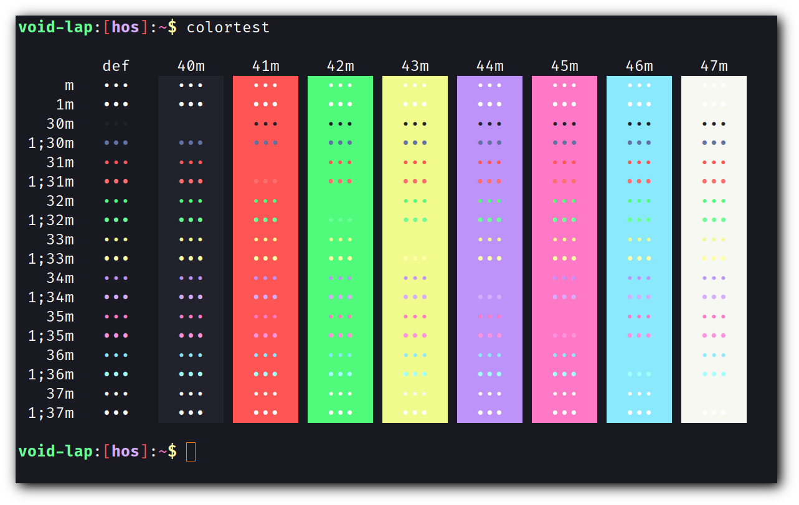
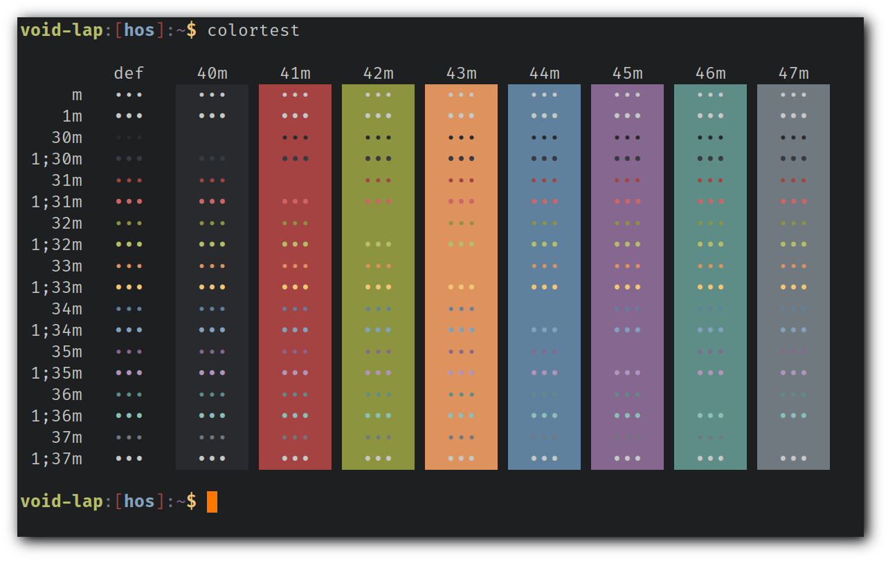
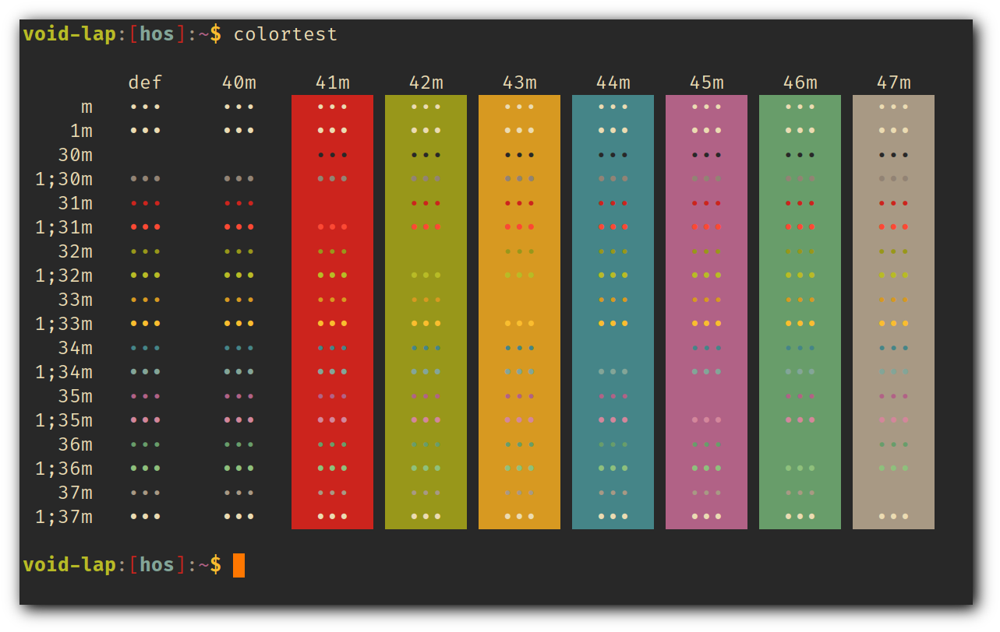
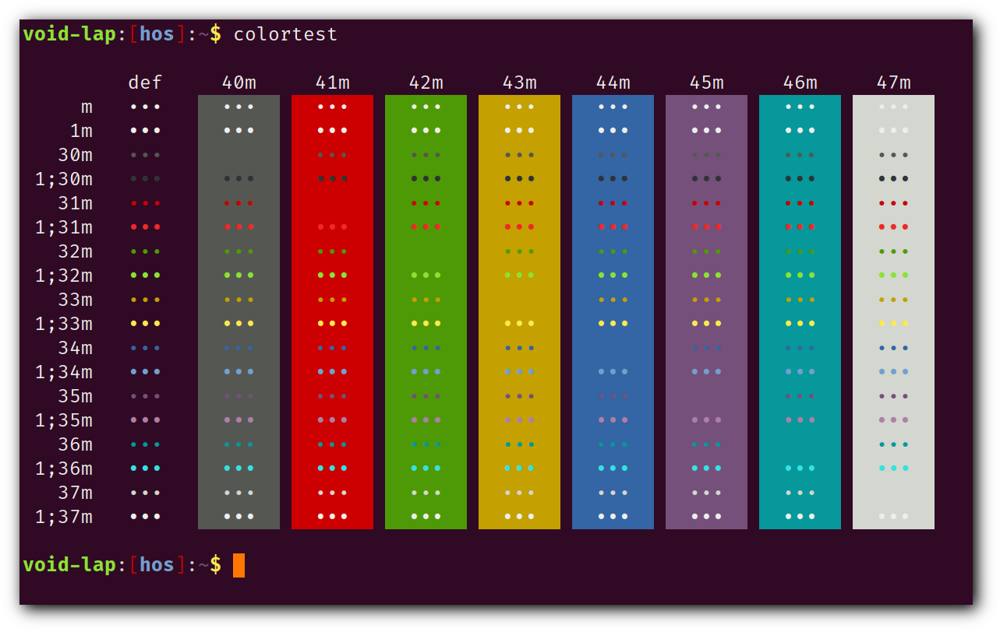

# st - simple terminal

st is a simple terminal emulator for X which sucks less.

## Requirements

In order to build st you need the Xlib header files.

+ libX11
+ libXft

### Extra dependencies (for applied patches)

+ alpha
    + an X composite manager (e.g. compton, xcompmgr)
+ ligatures
    + HarfBuzz
    

## Patches

+ alpha
    + `-A` option is added to allow changing the opacity value without compiling
    + changealpha
+ scrollblack
+ font2
+ ligatures
    + ligatures-alpha-scrollblack
+ newterm
    + newterm-tabbed
+ colorschemes
    + `-s` option to set the current colorscheme at commandline (deprecated)

## Installation

Edit config.mk to match your local setup (st is installed into
the /usr/local namespace by default).

Afterwards enter the following command to build and install st (if
necessary as root):

    make clean install

## Running st

If you did not install st with make clean install, you must compile
the st terminfo entry with the following command:

    tic -sx st.info

See the man page for additional details.

## Credits

Based on Aurélien APTEL <aurelien dot aptel at gmail dot com> bt source code.

## Screenshots

| **index** |     **name**    |                           **shot**                             |
|:----------|:----------------|:---------------------------------------------------------------|
|     0     | onedark         |                  |
|     1     | dracula         |                  |
|     2     | solarized-dark  |    |
|     3     | ayu-dark        |                |
|     4     | hybrid-dark     |                    |
|     5     | nord            |                        |
|     6     | gruvbox-dark    |        |
|     7     | ubuntu          |                    |
|     8     | default         |                  |
|     9     | solarized-light |  |

