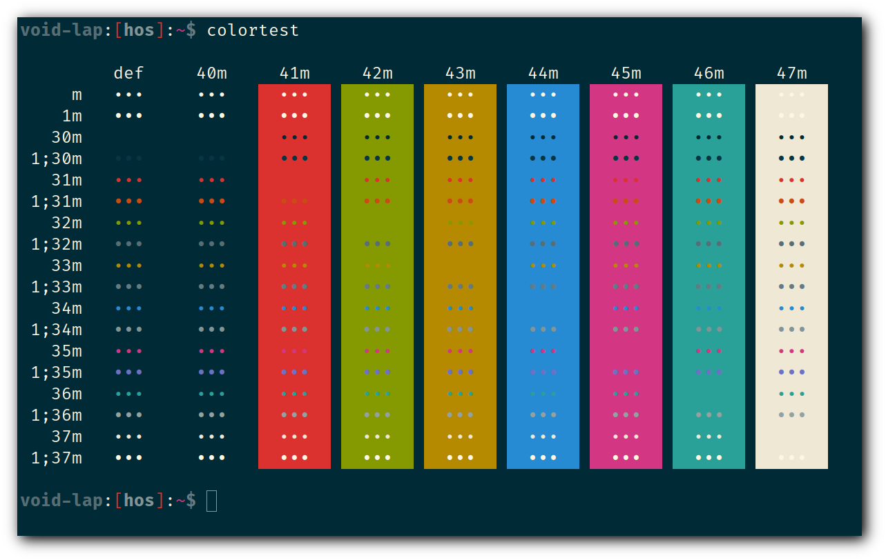
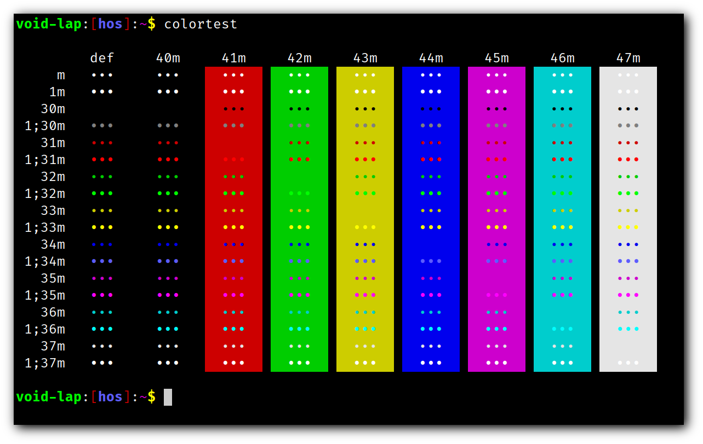

# st - simple terminal

st is a simple terminal emulator for X which sucks less.

## Requirements

In order to build st you need the Xlib header files.

### Extra dependencies (for applied patches)

+ alpha
    + an X composite manager (e.g. compton, xcompmgr)
+ ligatures
    + HarfBuzz
    

## Patches

+ alpha
    + `-A` option is added to allow changing the opacity value without compiling

## Installation

Edit config.mk to match your local setup (st is installed into
the /usr/local namespace by default).

Afterwards enter the following command to build and install st (if
necessary as root):

    make clean install

## Running st

If you did not install st with make clean install, you must compile
the st terminfo entry with the following command:

    tic -sx st.info

See the man page for additional details.

## Credits

Based on Aurélien APTEL <aurelien dot aptel at gmail dot com> bt source code.

## Screenshots

+ 
+ 
+ 
+ 
+ 
+ 
+ 
+ 
+ 
+ 

